# Developer Guide

## Introduction

MediVault is a Command Line Interface (CLI) application that will help to manage medication supplies within a pharmacy.
It is an integrated solution that provides real-time tracking of stocks, prescriptions and orders. The
purpose of this guide is to help developers set up and continue with the development of MediVault past version 2.1.

## Acknowledgements

* Inspiration for App Idea and OOP Structure: https://github.com/se-edu/addressbook-level2
* Inspiration for User Guide: https://se-education.org/addressbook-level3/UserGuide.html
* Inspiration for Developer Guide: https://se-education.org/addressbook-level3/DeveloperGuide.html
* PlantUML Tutorial: https://se-education.org/guides/tutorials/plantUml.html

## Contents

* [Glossary](#glossary)
* [Setting up environment](#setting-up-environment)
    * [Setting up](#setting-up)
    * [Before writing code](#before-writing-code)
* [Design](#design)
    * [Architecture](#architecture)
    * [Command](#command)
    * [Utilities](#utilities)
      * [Validator](#validator)
      * [Storage](#storage)
    * [Inventory](#inventory)
    * [Errors](#errors)
* [Implementation](#implementation)
    * [Main Logic](#main-logic)
    * [List Command](#list-command)
    * [Stock Commands](#stock-commands)
        * [AddStockCommand](#addstockcommand)
        * [DeleteStockCommand](#deletestockcommand)
        * [UpdateStockCommand](#updatestockcommand)
    * [Prescription Commands](#prescription-commands)
        * [AddPrescriptionCommand](#addprescriptioncommand)
        * [DeletePrescriptionCommand](#deleteprescriptioncommand)
        * [UpdatePrescriptionCommand](#updateprescriptioncommand)
    * [Order Commands](#order-commands)
        * [AddOrderCommand](#addordercommand)
        * [DeleteOrderCommand](#deleteordercommand)
        * [UpdateOrderCommand](#updateordercommand)
        * [ReceiveOrderCommand](#receiveordercommand)
    * [Archive Commands](#archive-commands)
        * [ArchivePrescriptionCommand](#archiveprescriptioncommand)
        * [ArchiveOrderCommand](#archiveordercommand)
* [Product Scope](#product-scope)
    * [Target user profile](#target-user-profile)
    * [Value proposition](#value-proposition)
* [User Stories](#user-stories)
* [Non-Functional Requirements](#non-functional-requirements)
* [Instructions for manual testing](#instructions-for-manual-testing)

## Glossary

Terminology | Meaning
------ | ------
Stock | Refers to a medication.
Prescription | Refers to a prescription.
Order | Refers to ordering new medications to replenish the stocks.
Parameters | Prefixes for MediVault to understand the type of information you provide.

Meaning of Icons:
- :information_source: Note
- :warning: Warning
- :bulb: Tip

## Setting up environment

### Setting up

1. Fork [this](https://github.com/AY2122S1-CS2113T-T10-1/tp/) repo, and clone the fork into your computer.
2. Ensure that you have [IntelliJ IDEA](https://www.jetbrains.com/idea/download/#section=windows)
   and [JDK 11](https://docs.aws.amazon.com/corretto/latest/corretto-11-ug/downloads-list.html) installed.
3. Configure the JDK
    * Follow the guide
      at [se-edu/guides IDEA: Configuring the JDK](https://se-education.org/guides/tutorials/intellijJdk.html) to ensure
      Intellij is configured to use JDK 11.
4. Import the project as a Gradle project
    * Follow the
      guide [se-edu/guides IDEA: Importing a Gradle project](https://se-education.org/guides/tutorials/intellijImportGradleProject.html)
      to import the project into IDEA.
    * Note: Importing a Gradle project is slightly different from importing a normal Java project.
5. Verify the setup
    * Locate the file `src/main/java/MediVault.java` then run the `MediVault.main()` and try a few commands
    * Run the [test](https://se-education.org/addressbook-level3/Testing.html) to ensure they all pass.

### Before writing code

1. Configure the coding style
    * If using IDEA, follow the
      guide [se-edu/guides IDEA: Configuring the code style](https://se-education.org/guides/tutorials/intellijCodeStyle.html)
      to set up IDEA’s coding style to match ours.
2. Set up CI
    * This project comes with a GitHub Actions config files (in `.github/workflows folder`). When GitHub detects those
      files, it will run the CI for your project automatically at each push to the `master` branch or to any PR. No set
      up required.

## Design

### Architecture

The **Architecture Diagram** for MediVault is shown below.

A quick overview of the main components and how they interact with each other is given below.

The main class that runs MediVault is called `MediVault`. It is responsible for,
* At program launch: Initializes the components in the correct sequence, and connects them up with each other.
* At shut down: Shuts down the components and invokes cleanup methods where necessary.

The rest of the program consist of four components.
* `Command`: Executes command based on the user input that is processed by `Utilities`
  component. The list of commands can be found in our User Guide [here](UserGuide.md).
* `Utilities`: Contains important driver classes for MediVault
  * Includes `parser`, `ui`, `storage` and `comparators`.
* `Inventory`: Contains a collection of classes used by MediVault to represent
different medication information.
* `Errors`: Contains collection of classes that handles exceptions during execution of MediVault.

### Command

The **Command** class diagram above shows how **Command** interact with other classes in MediVault.

The Command Component consists of **18** subclasses where each subclass represents a command feature.

Let `*` be either of the three class: `Stock`, `Prescription` or `Order`.

* `Add*Command`: Adds a new `*` information into MediVault.
* `Delete*Command`: Removes the visibility of the `*` record in MediVault.
* `Update*Command`: Updates the `*` information.
* `List*Command`: Lists the `*` records.
* `ReceiveOrderCommand`: Marks an order as received and adds the ordered medication into the current stocks.
* `ArchivePresciptionCommand`: Archives all the prescription records before a given date.
* `ArchiveOrderCommand`: Archives all the order records before a given date.
* `PurgeCommand`: Wipes all records in MediVault.
* `HelpCommand`: Shows the help page.
* `ExitCommand`: Exits MediVault.

### Utilities

#### Validator

The class diagram below shows how the validator classes is implemented to help ensure that the user input is
valid. `StockValidator`, `PrescriptionValidator` and `OrderValidator` inherits from `MedicineValidator`. The class
methods are also shown in the diagram.

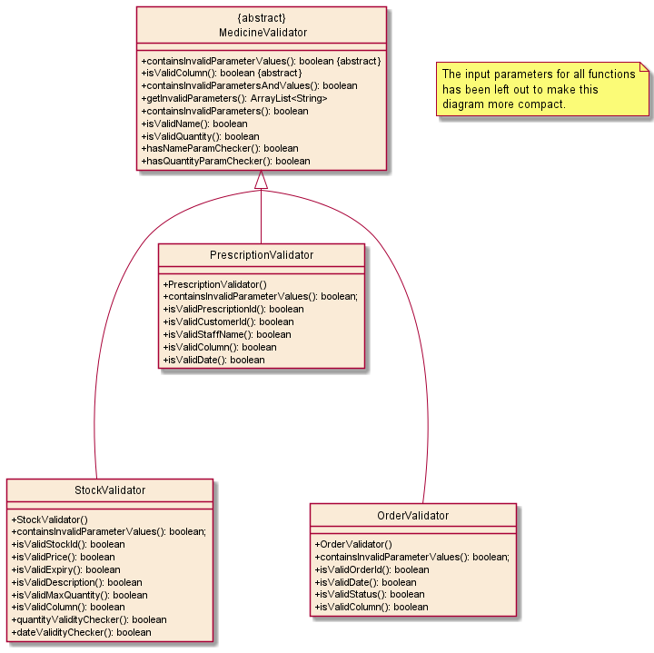

#### Storage

The `Storage` component of MediVault is implemented for purpose of loading, storing and archiving of data. Basically, it 
handles all file related processes necessary for MediVault to function. After every operation that modifies the stock, 
prescription or order, data will be automatically and dynamically saved into the corresponding data files.

`Storage` class is associated with `FileParser` class because during startup of MediVault, data will be loaded, 
and validation will be done in methods in FileParser.

`FileParser` class handles validation of data of the files `data/stock.txt`, `data/prescription.txt` and 
`data/order.txt`. If it detects anything invalid, it will throw an exception with specific information about which row
and which file the invalid data is. 

> :information_source: Note:
> * MediVault will not be able to start up until data in data files are deemed valid.
> * This is to prevent invalid data from entering the system caused by direct tampering of data files. 

The class diagram below shows the Storage component of MediVault.

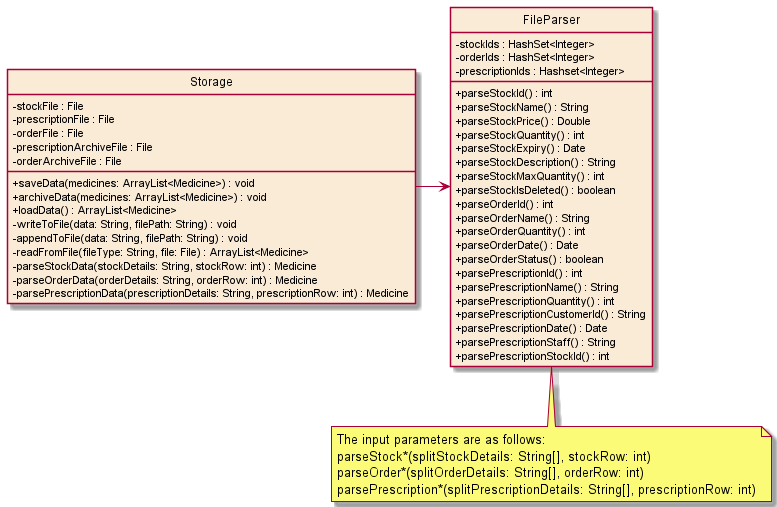

### Inventory

The class diagram below shows how the objects in MediVault is implemented. `Stock`, `Prescription`
and `Order` inherits from the abstract `Medicine` class. The attributes that each object has is also shown in the
diagram.

### Errors

- `InvalidCommandException` will be thrown when the user enters an invalid command.
- `InvalidDataException` will be thrown when MediVault encountered invalid data in the data files.

## Implementation

### Main Logic

The main application logic shows how the commands are handled throughout the application. Below is the outline of the
logic:

* MediVault is called by the `main` method which calls the constructor of MediVault. Data is then loaded from the
  `Storage` class to the application.
* MediVault gets the user input via the `Ui` class and uses the `CommandParser` class to parse the input given by the
  user.
* The parameters will be parsed to a `LinkedHashMap<String, String>` to make the parameters easily accessible.
* If a valid command is received, the `CommandParser` will call the `Command` object constructor and return the object
  to MediVault.
* MediVault will then invoke the `execute()` function of the `Command` object to execute the command.

> :warning: Warning:
> * Should there be an invalid command, `CommandParser` will throw `InvalidCommandException` and MediVault will display the error message using the `Ui` class.

Given below is the sequence diagram after `run()` is called for the interactions within the main application logic.

- `changeMode()` will be called when the user entered `stock`, `prescription` or `order` to help change modes.
- `processCommand()` helps to parse the user's command to a `Command` object.
- `parseParameters()` will return all the parameters entered as a `LinkedHashmap<String, String>`. This helps to make the
parameters entered by the user easily accessible by the `Command` objects. 

After the `.execute()` command is called, MediVault does the following validator checks as shown below.

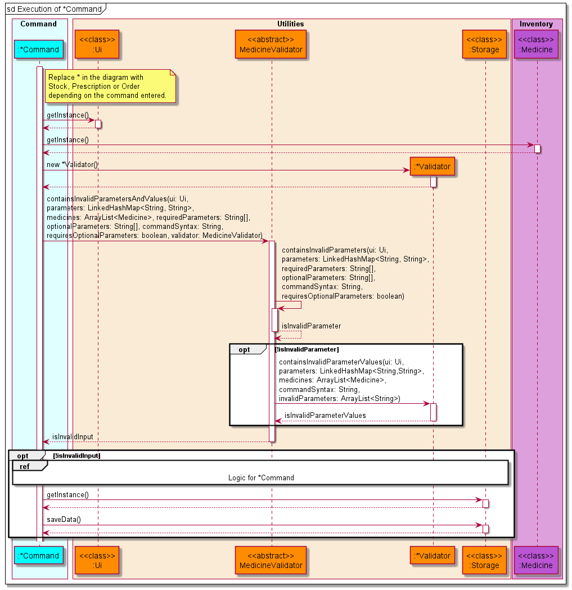

> :information_source: Note: Replace `*` with `Stock`, `Prescription` or `Order` depending on the command entered.

1. `*Command` attempts to get the instances of the `Ui` and `Medicine` classes which are a singletons if they exists. 
Otherwise, it creates a new instance of the `Ui` and/or `Medicine` class.
2. `*Command` creates a new `*Validator` instance which contains the methods to validate the user's input for the
respective `*`.
3. `*Command` runs `containsInvalidParametersAndValues()` and does validation checks explained in detail in **Step 4** 
and **Step 5**.
4. The `MedicineValidator` class runs `containsInvalidParameters()` to check if **parameters** input by the user are valid.
5. Then, `MedicineValidator` class runs `containsInvalidParameterValues()` in `*Validator` to check if 
**parameter values** input by the user is valid.
6. `MedicineValidator` will return the result of the validity checks back to `*Command`.
7. After running the Logic for `*Command`, commands that modifies the `*` information attempts to get the instance of 
`Storage` class which is a singleton if it exists. MediVault runs `saveData()` to save the latest information into the text file.

The motivation to implement an **initial validity checker** was because most of the commands requires MediVault to check 
if user input provided by the user are valid. This **guarantees** that the parameters and parameter values provided by 
the user are valid after it passes the validity checks.

The logic for all the `*Command` are further elaborated below.

### List Command

There are three variations of the list command.

1. `liststock`
2. `listprescription`
3. `listorders`

The sequence diagram below shows how the `list` operation works in general.

* All three variations of `list` are similar as they are implemented by iterating through the `Medicine` ArrayList and
  filtering out the respective object types.
* If the parameter `sort` or `rsort` is provided, the respective constructor of the `Comparator` classes will be invoked
  to help sort the ArrayList.
* For the rest of the valid command parameters, MediVault will do a **contains** comparison for strings and **equals**
  comparison for integers as well as dates except for `expiring` and `low` parameters where it will do a **less than or
  equal** comparison.
* `getAttributeValue()` represents all the get methods available in each of the respective classes. At the end of the
  execution the respective `print()` method from the `Ui` class will be called to display the respective tables.

### Stock Commands

#### AddStockCommand

MediVault creates an `AddStockCommand` object when CommandParser identifies `addstock` or `add` in `stock`
mode.
> :information_source: Note:
> * MediVault adds medicine stock when the `parameter` and `parameterValues` provided by the user are valid.
> * Users will not be able to input medication if `max_quantity` is less than `quantity`.
> * MediVault will ignore the `price`, `description` and `max_quantity` of user input if the same medication name and expiry date already exist.
> * MediVault will ignore the `description` and `max_quantity` of user input if the same medication name already exist.

The sequence diagram for `AddStockCommand` is shown below.

MediVault will determine if there exist the medication with the same name.
* If there exist medication with the same name, MediVault will check if there exist the same expiry date using the `isExpiryExist()` method.
  * MediVault will then check if the quantity is valid using the `isValidQuantity()` method.
  * If the same name and expiry date exist, Medivault will update the quantity of the existing stock.
  * If it does not exist the same expiry date, MediVault will add the medication using the existing description and maximum quantity.
* If it does not exist the same medication in MediVault, MediVault will then check if the quantity is valid using the `isValidQuantity()` method and a new medication will be added.

#### DeleteStockCommand

MediVault creates an `DeleteStockCommand` object when CommandParser identifies `deletestock` or the `delete` keyword
in `stock` mode.

* MediVault allows deletion of a stock by specifying stock id through `i/ID`.
* MediVault allows deletion of expiring stocks by specifying an expiry date through `expiring/EXPIRY_DATE`.

> :information_source: Note:
> * MediVault deletes medicine stock information when `parameter` and `parameterValues` provided by the user are valid.
> * MediVault performs a check to determine if it is executing deletion by stock id or deletion by expiry then executes
  accordingly.
> * MediVault will not execute if both id and expiry date are specified. 

The sequence diagram for `DeleteStockCommand` is shown below.

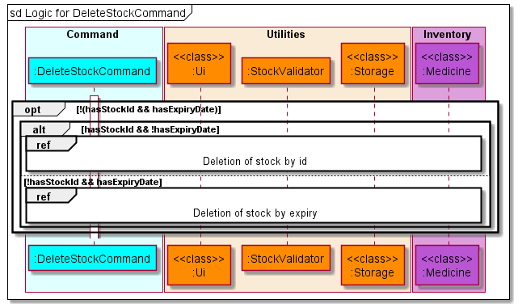

If MediVault determines that it is executing deletion by stock id, it will execute accordingly. Currently, it only
allows for deletion of 1 stock at a time.

The sequence diagram for deletion by stock id is shown below.

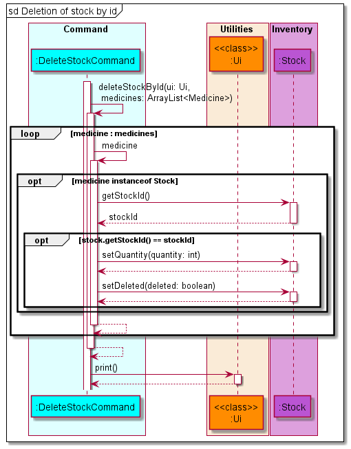

* `deleteStockById()` deletion of stock given an id.
  * Loops through all medicines to `getStockId()` to compare and get the specified stock.
  * Then call `setDeleted()` to delete the stock.

If MediVault determines that it is executing deletion by expiry date, it will execute accordingly. The behaviour of
this command is to delete all stock that have <= specified date. This is because we would want to delete all expired
stock and if a date is specified, all the date before will also be expired hence implement deletion of <= date.

The sequence diagram for delete by expiry date is shown below.

* `deleteStockByExpiry()` deletion of stock given an id.
  * `stringToDate()` helps to parse a string to a Date object.
  * Loops through all medicines to `getExpiry()` to compare and get the all expired stock.
  * Then call `setDeleted()` to delete the stock.

#### UpdateStockCommand

MediVault creates an `UpdateStockCommand` object when CommandParser identifies `updatestock` or
the `update` keyword in `stock` mode.

The sequence diagram for `UpdateStockCommand` is shown below.

MediVault retrieves the stock object using the `i/ID` parameter specified by the user using the `extractStockObject()` 
method. MediVault conducts another validation check on the provided `q/QUANTITY`,`m/MAX_QUANTITY` and `e/EXPIRY_DATE`
against the stock object retrieved earlier. This validation check is separated from the initial validation checker
as enforcing `q/QUANTITY` <= `m/MAX_QUANTITY` can only be done **after** MediVault confirms what user input is
provided. This is because the backend processing for either one or both parameters provided by the user are different.

MediVault adds a new stock record when a user update contains the `n/NAME` parameter. The old stock record still
exists in MediVault, but it will not be visible to user when listed. This approach solves the issue when a user is
unable to delete a prescription record when the medicine stock name gets updated.

### Prescription Commands

#### AddPrescriptionCommand

MediVault creates an `AddPrescriptionCommand` object when CommandParser identifies `addprescription` or  
`add` in `prescription` mode.

> :information_source: Note:
> * MediVault adds the prescription when the `parameter` and `parameterValues` provided by the user are valid.
> * MediVault will update the quantity left in the stock automatically after prescribing.
> * MediVault will prescribe medication with the earliest date if there are medication with multiple expiry dates.
> * Users will not be able to prescribe expired medication.
> * Users will not be able to prescribe medication if the quantity is more than the total stock quantity.

The sequence diagram for `AddPrescriptionCommand` is shown below.

- `prescribe()` method will change the stock quantity based on prescription quantity and add prescribed medication to prescription list.

#### DeletePrescriptionCommand

MediVault creates a `DeletePrescriptionCommand` object when CommandParser identifies `deleteprescription` or
`delete` in `prescription` mode.

> :information_source: Note:
> * MediVault deletes the prescription when the `parameter` and `parameterValues` provided by the user are valid.
> * MediVault will delete the prescription based on the user input of `PRESCRIPTION_ID`.
> * MediVault will add the prescription quantity to the stock quantity after successful deletion of prescription.
> * User will not be able to delete prescriptions if the total quantity after prescription will be more than the maximum
  quantity.

The sequence diagram for `DeletePrescriptionCommand` is shown below.

> :bulb: Tip: If the stock is deleted, MediVault will recover the stock and add the prescription quantity to the stock.

- `setStockQuantity()` method will check stock if stock exist. If stock exist, add the quantity to the stock quantity.

#### UpdatePrescriptionCommand

MediVault initialises an `UpdatePrescriptionCommand` class when CommandParser identifies
`updateprescription` or the `update` keyword in `prescription` mode.

The sequence diagram for `UpdatePrescriptionCommand` is shown below.

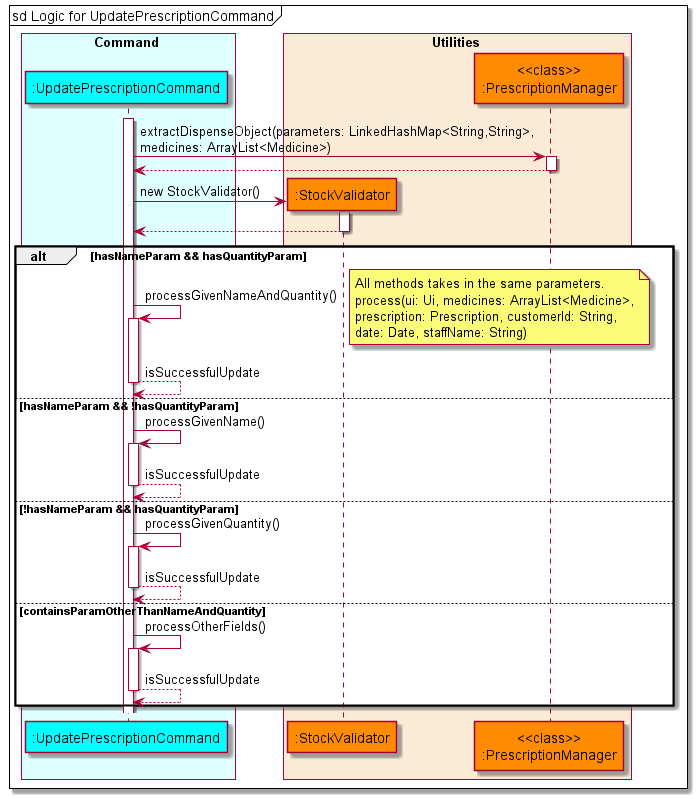

MediVault retrieves the prescription object using the `i/ID` parameter specified by the user using the
`extractPrescriptionObject()` method.

The main update logic is split into four sections.
1. User provided both `n/NAME` and `q/QUANTITY` parameters.
   1. MediVault restores the stock quantity for the **original** `n/NAME` with the **original** `q/QUANTITY`.
   2. MediVault decrements the stock quantity for the **updated** `n/NAME` with the **updated** `q/QUANTITY`. 
2. User provided `n/NAME` parameter but not `q/QUANTITY`.
   1. MediVault restores the stock quantity for the **original** `n/NAME` with the `q/QUANTITY` present in the 
   prescription object.
   2. MediVault decrements the stock quantity for the **updated** `n/NAME` with the `q/QUANTITY` present in the
   prescription object.
3. User provided `q/QUANTITY` parameter but not `n/NAME`
   1. If the **updated** `q/QUANTITY` is more than the **original** `q/QUANTITY` MediVault decrements the stock quantity 
   for `n/NAME` present in the prescription object with the additional `q/QUANTITY` which is the difference between the
   **updated** and **original** `q/QUANTITY`.
   2. Otherwise, MediVault restores the stock quantity for `n/NAME` present in the prescription object with the
   difference between the **updated** and **original** `q/QUANTITY`.
4. User did not provide both `q/QUANTITY` and `n/NAME` parameter.
   1. Restoring or decrement is needed.

Other parameters like `d/DATE`, `c/CUSTOMER_ID` and `s/STAFF` are not affected because they share the same
update logic for sections 1 to 4 mentioned above.

MediVault adds a new prescription record when a user updates contains either the `n/NAME`, `q/QUANTITY`
parameter or both. The old prescription record is **permanently removed** from MediVault.

This approach solves the issue when a medication is prescribed to a user with an amount that is 
**more than** the current batch of stock with the same Stock ID but **less than** the total 
stock quantity. 

> :bulb: Tip: MediVault automatically adds new prescription records when a medication is prescribed
> from stocks with different Stock IDs.

### Order Commands

### AddOrderCommand

MediVault creates an `AddOrderCommand` object when CommandParser identifies `addorder` or the `add` keyword
in `order` mode.

> :information_source: Note:
> * MediVault adds order information when `parameter` and `parameterValues` provided by the user are valid.
> * As the order date is an optional parameter, MediVault will use the date the order was placed as the default date.
> * Users will not be unable to add orders if the order quantity exceeds maximum stock quantity.

The sequence diagram for `AddOrderCommand` is shown below.

`addDate()` method will add order date based on whether the user provided the date parameter or not.
`addOrder()` method will add order based on user input.

MediVault will determine if there exist the medication with the same name in order and in stock.

* If there exist medication with the same name in order and in stock, MediVault will check if the `orderQuantity +
existingStockQuantity + existingOrderQuantity <= maxQuantity` to ensure total order quantity does not exceed the 
existing maximum stock quantity allowed.
* If there exist medication with the same name in order but not in stock, MediVault will check if the `orderQuantity
< maxQuantity`, where `maxQuantity = Integer.MAX_VALUE` to allow the user to add any quantity of medication.
* If there does not exist medication with the same name in order, MediVault will not check for valid quantity and
will simply add the order as a new order.

#### DeleteOrderCommand

MediVault creates a `DeleteOrderCommand` object when CommandParser identifies `deleteorder` or  `delete` in `order`
mode.

> :information_source: Note:
> * MediVault deletes the order when the `parameter` and `parameterValues` provided by the user are valid.

The sequence diagram for `DeleteOrderCommand` is shown below.

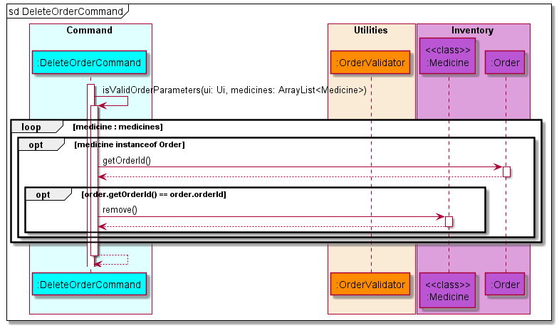

#### UpdateOrderCommand

MediVault creates an `UpdateOrderCommand` object when CommandParser identifies
`updateorder` or the `update` keyword in `order` mode.

The sequence diagram for `UpdateOrderCommand` is shown below.

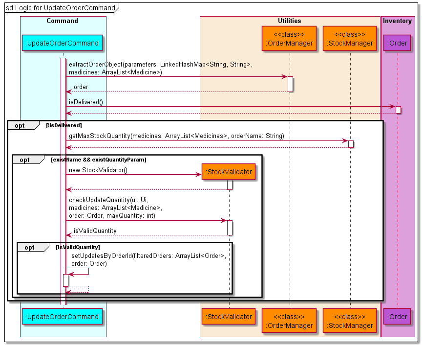

MediVault retrieves the order object using the `i/ID` parameter specified by the user using the
`extractOrderObject()` method.

> :warning: Warning:
> * MediVault disables updating an order that has been delivered. Users can only update information for pending orders.

MediVault conducts a check if an order quantity is valid with the provided `q/QUANTITY`.
This validation check is separated from the initial validation checker as enforcing `q/QUANTITY` <= `m/MAX_QUANTITY` in 
stocks can only be done **after** MediVault confirms that the user provides a `q/QUANTITY` is an integer.

MediVault updates the order information only when all of the validation checks stated above are successful.

### ReceiveOrderCommand

MediVault creates an `ReceiveOrderCommand` object when `CommandParser` identifies
`receiveorder` or the `receive` keyword in `order` mode.

> :information_source: Note:
> * MediVault will add the order to stock if the `parameters` and `parameterValues` provided by the user are valid.
> * `ReceiveOrderCommand` will call `AddStockCommand` once the `parameters` and `parameterValues` are validated.
> * If the order contains a medication already in stock, the `d/DESCRIPTION` and `m/MAX_QUANTITY` will be ignored
> and existing values will be used.
> * If the `e/EXPIRY_DATE` provided is the same as the one in stock, `p/PRICE` will be ignored as well.

The sequence diagram for `ReceiveOrderCommand` is shown below.

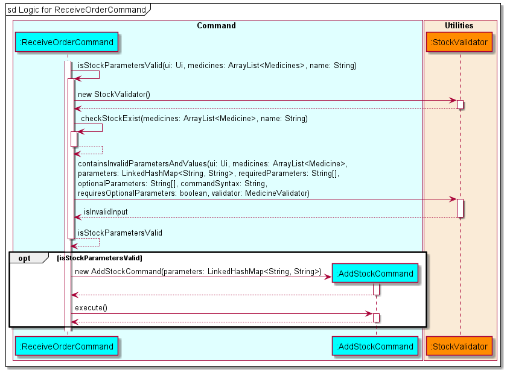

- `isStockParametersValid()` helps to ensure that the parameters for the stock to be added are valid.
- `checkStockExist()` helps to check if a medication exists in stock.

MediVault will then check if the quantity increased before setting the order as completed. This helps to ensure that
only after the stock is successfully added, then the order would be complete.

### Archive Commands

#### ArchivePrescriptionCommand

MediVault creates an `ArchivePrescriptionCommand` object when CommandParser identifies `archiveprescription` or the 
`archive` keyword in `prescription` mode.

* MediVault archives prescription records by specifying a date through `d/DATE`.
* MediVault will remove prescription records that have date <= specified date and output it into the file named
  `data/prescription_archive.txt`

> :information_source: Note:
> * MediVault archive prescription information when `parameter` and `parameterValues` provided by the user are valid.
> * MediVault will output prescription information into a user readable format in `data/prescription_archive.txt`.
> * To modify the format, edit the code in `toArchiveFormat()` method in the Prescription Class.

The sequence diagram for ArchivePrescriptionCommand is shown below.

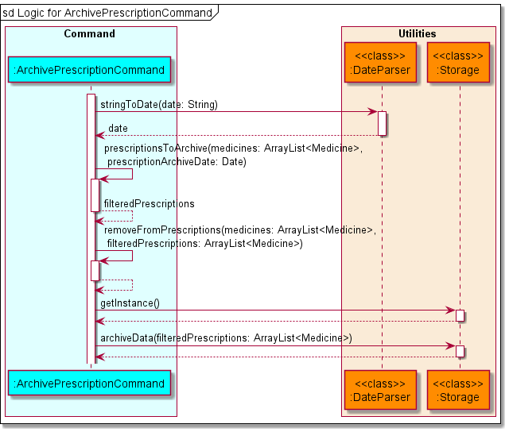

* `stringToDate()` helps to parse a string to a Date object.
* `prescriptionsToArchive()` checks through all prescriptions and look for records that have prescription date <= 
specified date.
* `removeFromPrescriptions()` removes prescriptions from prescription list after archive.

#### ArchiveOrderCommand

MediVault creates an `ArchiveOrderCommand` object when CommandParser identifies `archiveorder` or the
`archive` keyword in `order` mode.

* MediVault archives order records by specifying a date through `d/DATE`.
* MediVault will remove only DELIVERED order records that have date <= specified date and output it into the file named
`data/order_archive.txt`

> :information_source: Note:
> * MediVault archive order information when `parameter` and `parameterValues` provided by the user are valid.
> * MediVault will output order information into a user readable format in `data/prescription_archive.txt`.
> * To modify the format, edit the code in `toArchiveFormat()` method in the Order Class.

The sequence diagram for ArchiveOrderCommand is shown below.

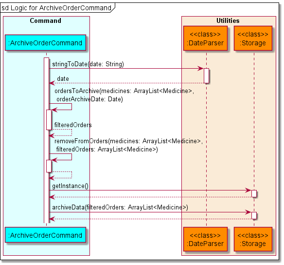

* `stringToDate()` helps to parse a string to a Date object.
* `prescriptionsToArchive()` checks through all orders and look for records that are DELIVERED and have order date <=
  specified date.
* `removeFromOrders()` removes orders from order list after archive.

## Product Scope

### Target user profile

* Pharmacist handling storing, ordering and prescribing of medication
* Has a need to manage large number of stocks in the pharmacy
* May forget how much medicine stock is left in the pharmacy
* Is a fast typist

### Value proposition

The main value proposition of MediVault is such that it provides the user with an interface for efficient stock taking
purposes. It eradicates the need for manual tracking of medications which will greatly lessen the administrative 
workload of a pharmacist. It automates stock taking process to a certain extent because it is a 3 in 1 integrated 
solution that provides real-time tracking of stock, prescriptions and orders in a pharmacy,  

## User Stories

|Version| As a ... | I want to ... | So that I can ...|
|--------|----------|---------------|------------------|
|v1.0|pharmacist|list out all of the medicines currently on shelf| know the current quantity of the medicines on shelf
|v1.0|manager| purge all data|start afresh
|v1.0|user| exit the program|shutdown my computer
|v1.0|pharmacist|list the price of each medication|know the price of each medication
|v1.0|pharmacist|sort medication by price|recommend the customer the cheapest one if he asks
|v1.0|pharmacist| update medication information| modify information using a single command instead of deleting and adding the updated medication information
|v1.0|pharmacist|update the limit of a medication|have enough stocks in the event that I foresee a surge in demand
|v1.0|pharmacist|add new types of medicines| keep track of all the medication supplies on 1 platform
|v1.0|pharmacist|delete a medicine|remove it from the system in the event of a product recall or end of production
|v1.0|pharmacist|search for medication for specific symptoms|give the right medication
|v1.0|pharmacist|set a limit on the number of medications to be added to the stocks|prevent an oversupply of medication
|v1.0|user|search for a specific medication|look for a medication without looking through the full list
|v2.0|pharmacist|check which medication is expiring soon|order a new batch of supplies in time for my patients
|v2.0|pharmacist| check which medication is low in quantity| order a new batch of supplies in time for my patients
|v2.0|pharmacist|confirm a received order|know if an order is successfully received
|v2.0|manager|create orders|order medication.
|v2.0|pharmacist|archive past prescription records|prevent records from being cluttered
|v2.0|pharmacist| archive past order records|prevent records from being cluttered
|v2.0|pharmacist| list all orders|keep track of them
|v2.0|pharmacist|know the status of order| know whether the supply is ordered or received.
|v2.0|pharmacist|saved record of the current medicine stock| have a saved file record to refer to
|v2.0|pharmacist|saved record of the current medicine orders| have a saved file record to refer to
|v2.0|manager|saved record of the current medicine prescription| have a saved file record to refer to
|v2.0|pharmacist|prescribe medication|tally the number of medications when I prescribed some to my patients
|v2.0|pharmacist|delete prescription| delete a prescription record
|v2.0|manager|delete orders|cancel orders
|v2.0|pharmacist| update prescription information| modify information using a single command instead of deleting and adding the updated prescription information
|v2.0|pharmacist|delete ALL expired medications|expired medications will not be sold to customers or patients
|v2.0|manager|edit orders| update any wrong information
|v2.0|manager|see the pending orders to reflect in my current stocks|ensure that I won't double order on the same medication
|v2.0|pharmacist|search for records by a specific customer|see all his prescriptions
|v2.0|manager|check who prescribe what medication|know who is responsible for the prescription

## Non-Functional Requirements

* **Accessibility Requirements:** MediVault should be able to run locally without internet connection.
* **Capacity Requirements:** MediVault should try to store only important details to minimize data file size as there may be
many data records after long usage. Perhaps could save into multiple files or archive data.
* **Compliance with regulations requirements:** MediVault should comply with regulations related to storing of sensitive
customer information.
* **Documentation Requirements:** MediVault user guide should be documented in a way that a pharmacist without CLI
experience can understand and learn how to use the application.
* **Efficiency Requirements:** MediVault should make use of efficient data structures and algorithms where appropriate to 
optimise speed if possible. However, it is not really a top priority.
* **Extensibility Requirements:** MediVault should minimally manage medications. In the future can probably expand inventory
to handle medical supplies in general.
* **Fault Tolerance Requirements:** MediVault should perform sufficient error handling and provide helpful error response
messages to suggest correct input to user. 
* **Interoperability Requirements:** MediVault should be able to run on minimally Windows, Linux and macOS.
* **Privacy Requirements:** MediVault may contain sensitive information such as customer health records. Thus, we should not 
publish our data to the internet and only store it on our local computer.
* **Portability Requirements:** MediVault should be able to run on any computer that has Java 11 and MediVault.jar. Data
should also be portable such that we can easily transfer data when changing computers.
* **Reliability Requirements:** MediVault should not crash at any point in time. Even if it does, it must retain data.
* **Response Time Requirements:** MediVault basic operations should respond within 3 seconds. For other processing heavy
operations such as start up and loading of data, it should respond within maximum of 15 seconds.
* **Robustness Requirements:** MediVault should have some had some testing done be it JUnit Tests or automated I/O 
redirection tests.
* **Scalability Requirements:** MediVault should be built to handle amount of data a small to medium enterprise would have.
* **Stability Requirements:** MediVault should function as per normal regardless of how many error user has made.
* **User Requirements:** MediVault should be user-friendly such that it is usable by a pharmacist with no CLI experience.

## Instructions for manual testing

### Starting up and Shutting Down

1. Download the latest release [here](https://github.com/AY2122S1-CS2113T-T10-1/tp/releases).
2. Run MediVault using `java -jar MediVault.jar`
3. To end program, enter the command `exit`.

### Running commands

1. You can refer to the list of commands and expected
   outputs [here](https://ay2122s1-cs2113t-t10-1.github.io/tp/UserGuide.html).

### Saving Data

All data files are located in the data folder.

1. Data is saved in stock.txt, prescription.txt, order.txt.
    * Test Case:
        1. Run the application.
        2. Add an entry to stock, prescription and order into MediVault.
        3. Exit MediVault. The stock.txt, prescription.txt and order.txt will have one entry.
        4. Run the application.
        5. Delete entry to stock, prescription and order into MediVault.
        6. Exit MediVault.
    * Expected: stock.txt, prescription.txt and order.txt will be empty.
2. Archive data is saved in archiveorder.txt and archiveprescription.txt.
    * Test Case:
        1. Run the application.
        2. Add entries to prescription and order into MediVault.
        3. Run the `archiveorder` and `archiveprescription` command with date specified.
        4. Exit MediVault.
    * Expected: archiveorder.txt and archiveprescription.txt will have entries.
   
